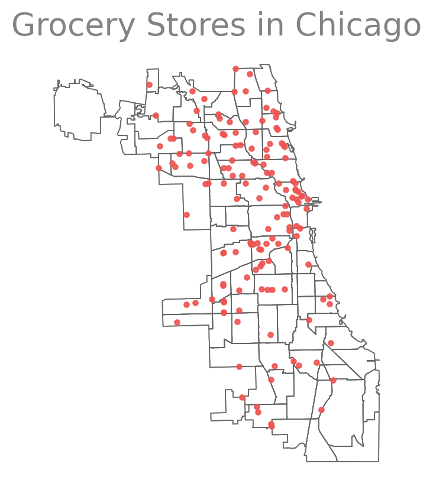

::: {.cell execution_count=1}
``` {.python .cell-code code-fold="true" code-summary="Imports"}
from rich.console import Console as Console
from enrich.style import STYLES
from rich.theme import Theme
console = Console(theme=Theme(STYLES), log_path=False, markup=True)
```
:::


::: {layout-ncol=2 layout-valign="top"}

::: {}

We will walk through an example that demonstrates how to clip geometries to the
boundary of a polygon geometry using GeoPandas.


::: {.callout-note title="Target Goals" collapse="false" style="width:100%;"}

- Can you identify which neighborhoods have the most grocery stores? How many?
    - Which have the least? How many?

:::

This example shows how to clip a set of vector geometries to the spatial extent
/ shape of another object.

Both sets of geometries must be opened with `GeoPandas` as `GeoDataFrame`s and
be in the same **Coordinate Reference System** (`CRS`) for the `clip` function
from `GeoPandas` to work.

This example uses data from `geodatasets`, namely:

- `geoda.chicago-health`
- `geoda.groceries`

alongside a custom rectangle geometry made with shapely and then turned into a
`GeoDataFrame`.

:::

::: {#fig-groceries .r-stretch}

::: {.cell execution_count=2}

::: {.cell-output .cell-output-display}
{width=366 height=417}
:::
:::


A map showing the neighborhoods of Chicago as well as the location of various
grocery stores.

:::

:::

::: {.callout-warning title="Warning" collapse="false" style="width:100%;"}

The object to be clipped will be clipped to the full extent of the clip object.  
If there are multiple polygons in clip object, the input data will be clipped
to the total boundary of all polygons in clip object.

:::


## Imports

::: {.cell execution_count=3}
``` {.python .cell-code}
%load_ext autoreload
%autoreload 2
%matplotlib inline
import matplotlib_inline
import matplotlib.pyplot as plt
matplotlib_inline.backend_inline.set_matplotlib_formats('svg')

import geopandas as gpd
from shapely.geometry import box
import geodatasets
```

::: {.cell-output .cell-output-stdout}
```
The autoreload extension is already loaded. To reload it, use:
  %reload_ext autoreload
```
:::
:::


## Get or Create Example Data

Below, the example GeoPandas data is imported and opened as a `GeoDataFrame`.

Additionally, a polygon is created with shapely and then converted into a
`GeoDataFrame` with the same CRS as the `GeoPandas` dataset

::: {.cell execution_count=4}
``` {.python .cell-code}
import geodatasets
chicago = gpd.read_file(geodatasets.get_path("geoda.chicago_commpop"))
groceries = gpd.read_file(geodatasets.get_path("geoda.groceries")).to_crs(chicago.crs)
```
:::


Create a subset of the chicago data that is just the near west side

::: {.cell execution_count=5}
``` {.python .cell-code}
near_west_side = chicago[chicago["community"] == "NEAR WEST SIDE"]
lincoln_park = chicago[chicago["community"] == "LINCOLN PARK"]
logan_square = chicago[chicago["community"] == "LOGAN SQUARE"]
```
:::


Create a custom polygon

::: {.cell execution_count=6}
``` {.python .cell-code}
polygon = box(-87.8, 41.9, -87.5, 42)
poly_gdf = gpd.GeoDataFrame([1], geometry=[polygon], crs=chicago.crs)
```
:::


## Plot the Unclipped Data

::: {.cell execution_count=7}
``` {.python .cell-code}
fig, (ax1, ax2) = plt.subplots(figsize=(14, 6), ncols=2, sharey='col')
poly_gdf.boundary.plot(ax=ax1, color=COLORS['red'])
chicago.boundary.plot(ax=ax1, color=COLORS['grey060'], linewidth=0.6, zorder=-1)
# near_west_side.boundary.plot(ax=ax2, color=COLORS['red'])
# near_west_side.plot(ax=ax2, color=COLORS['green'], alpha=0.3)
# west_town.plot(ax=ax2, color=COLORS['green'], alpha=0.3)
chicago.plot(ax=ax1, alpha=0.4)
poly_gdf.boundary.plot(ax=ax2, color=COLORS['red'])
chicago.boundary.plot(ax=ax2, color=COLORS['grey060'], linewidth=0.6, zorder=-1)
groceries.plot(ax=ax2, color=COLORS['blue'], zorder=1, marker='.', alpha=0.66)
ax1.set_title("All Unclipped Chicago Communities", fontsize=20)
ax2.set_title("All Unclipped Groceries", fontsize=20)
ax1.set_axis_off()
ax2.set_axis_off()
plt.tight_layout()
```

::: {.cell-output .cell-output-display}
{}
:::
:::


## Clip the Data

The object on which you call `clip` is the object that will be clipped.

The object you pass is the clip extent.

The returned output will be a new clipped `GeoDataFrame`. All of the attributes
for each returned geometry will be retained when you clip.

::: {.callout-tip title="Coordinate Reference System" collapse="false"}

Recall that the data must be in the same CRS in order to use the `clip` method.

If the data is not in the same CRS, be sure to use the `GeoDataFrame.to_crs`
method to ensure both datasets are in the same CRS.
:::

::: {.cell execution_count=8}
``` {.python .cell-code}
# clip the data to the boundary of the polygon
chicago_clipped = chicago.clip(polygon)
groceries_clipped = groceries.clip(polygon)

# create figure with two columns
fig, ax = plt.subplots(figsize=(14, 6), ncols=2, sharey='col')

# aggregate data into a dictionary for each column
clipped = {
    'chicago': {
        'ax': ax[0],
        'color': 'C0',
        'marker': None,
        'data': chicago_clipped,
        'label': 'Chicago Clipped'
    },
    'groceries': {
        'ax': ax[1],
        'color': 'C1',
        'marker': '.',
        'data': groceries_clipped,
        'label': 'Groceries Clipped'
    }
}

# iterate over the dictionary, plotting
# each entry in its own subplot (column)
for key, val in clipped.items():
    _ = val['data'].plot(
        ax=val['ax'],
        color=val['color'],
        marker=val['marker'],
        alpha=0.5,
    )
    _ = chicago.boundary.plot(
        ax=val['ax'],
        color=COLORS['grey060'],
        zorder=-1,
        linewidth=0.6
    )
    ax = poly_gdf.boundary.plot(
        ax=val['ax'],
        color=COLORS['red']
    )
    ax.set_title(val['label'], fontsize=20)
    ax.set_axis_off()

plt.tight_layout()
```

::: {.cell-output .cell-output-display}
{}
:::
:::


## Clip the Groceries Data

Next we'll look at the distribution of grocery stores in two different communities.

::: {#fig-unclipped .r-stretch}

::: {.cell execution_count=9}
``` {.python .cell-code}
fig, (ax1, ax2) = plt.subplots(figsize=(14, 6), ncols=2, sharey='col')

chicago.plot(ax=ax1, alpha=0.4)

# near_west_side.boundary.plot(ax=ax2, color=COLORS['red'])
# logan_square.boundary.plot(ax=ax2, color=COLORS['red'])

near_west_side.plot(ax=ax2, color=COLORS['red'], alpha=0.3)
logan_square.plot(ax=ax2, color=COLORS['red'], alpha=0.3)

chicago.boundary.plot(ax=ax1, color=COLORS['grey060'], linewidth=0.6, zorder=-1)
chicago.boundary.plot(ax=ax2, color=COLORS['grey060'], linewidth=0.6, zorder=-1)

groceries.plot(ax=ax2, color=COLORS['blue'], zorder=1, marker='.', alpha=0.66)
ax1.set_title("Chicago Communities", fontsize=20)
ax2.set_title("Grocery Stores", fontsize=20)
ax1.set_axis_off()
ax2.set_axis_off()
plt.tight_layout()
```

::: {.cell-output .cell-output-display}
{}
:::
:::


Visualization of the communities of Chicago (left) and the locations of grocery stores throughout the city.
:::


## Groceries in Near West Side

::: {.r-stretch}

::: {.cell execution_count=10}
``` {.python .cell-code}
groceries_west_side = groceries.clip(near_west_side)
fig, ax = plt.subplots(figsize=(14, 6))
groceries_west_side.plot(ax=ax, color='C2', marker='.', alpha=0.6)
chicago.boundary.plot(ax=ax, color=COLORS['grey060'], linewidth=0.6, zorder=-1)
near_west_side.boundary.plot(ax=ax, color='#444444')
near_west_side.boundary.plot(ax=ax, color=COLORS['red'])
near_west_side.plot(ax=ax, color=COLORS['green'], alpha=0.3)
ax.set_title("Groceries in the Near West Side")
ax.set_axis_off()
```

::: {.cell-output .cell-output-display}
{}
:::
:::


:::

## Groceries in Logan Square

::: {.r-stretch}

::: {.cell execution_count=11}
``` {.python .cell-code}
groceries_logan_square = groceries.clip(logan_square)
fig, ax = plt.subplots(figsize=(14,6))
groceries_logan_square.plot(ax=ax, color='C2', marker='.', alpha=0.6)
chicago.boundary.plot(ax=ax, color=COLORS['grey060'], linewidth=0.6, zorder=-1)
logan_square.boundary.plot(ax=ax, color='#444444')
logan_square.boundary.plot(ax=ax, color=COLORS['red'])
logan_square.plot(ax=ax, color=COLORS['green'], alpha=0.3)
ax.set_title("Groceries in Logan Square")
ax.set_axis_off()
```

::: {.cell-output .cell-output-display}
{}
:::
:::


:::

## Groceries in Lincoln Park

::: {.r-stretch}

::: {.cell execution_count=12}
``` {.python .cell-code}
groceries_lp = groceries.clip(lincoln_park)
fig, ax = plt.subplots(figsize=(14,6))
groceries_lp.plot(ax=ax, color='C2')
chicago.boundary.plot(ax=ax, color=COLORS['grey060'], linewidth=0.6, zorder=-1)
lincoln_park.boundary.plot(ax=ax, color='#444444')
lincoln_park.boundary.plot(ax=ax, color=COLORS['red'])
lincoln_park.plot(ax=ax, color=COLORS['green'], alpha=0.3)
ax.set_title("Groceries in Lincoln Park")
ax.set_axis_off()
```

::: {.cell-output .cell-output-display}
{}
:::
:::


:::

## Additional Questions

- Can you identify which neighborhoods have the most grocery stores? How many?
    - Which have the least? How many?

## Reference

[GeoPandas: Clip Vector Data](https://geopandas.org/en/stable/gallery/plot_clip.html)

