::: {.callout-note title="Target Goals" collapse="false" style="width:100%;"}

- Repeat this analysis with:
    - Different climate variables
    - Another state / geographic area
    - Another climate scenario

- Any interesting trends or insights to be drawn from the data

:::


::: {.cell execution_count=1}
``` {.python .cell-code code-fold="true" code-summary="Imports"}
%matplotlib inline
import matplotlib_inline
import matplotlib.pyplot as plt
import geopandas as gpd
import warnings

import matplotlib.pyplot as plt

# from enrich.console import Console, get_theme
matplotlib_inline.backend_inline.set_matplotlib_formats('svg')
from ClimRR.data import DATA_DIR
from ClimRR import get_logger, set_plot_style
set_plot_style()
log = get_logger('ClimRR')
from rich.console import Console as rConsole
from enrich.style import STYLES
from rich.theme import Theme

theme = Theme(STYLES)
log = get_logger('ClimRR')
console = rConsole(theme=theme, log_path=False, markup=True)
```

::: {.cell-output .cell-output-display}

```{=html}
<pre style="white-space:pre;overflow-x:auto;line-height:normal;font-family:Menlo,'DejaVu Sans Mono',consolas,'Courier New',monospace">Using updated plot style for matplotlib
</pre>
```

:::
:::


::: {.cell execution_count=2}
``` {.python .cell-code}
from ClimRR.data import load_shapefile, load_csvs

shape = load_shapefile()
data = load_csvs(shape)
```

::: {.cell-output .cell-output-display}

```{=html}
<pre style="white-space:pre;overflow-x:auto;line-height:normal;font-family:Menlo,'DejaVu Sans Mono',consolas,'Courier New',monospace">data<span style="font-weight: bold">[</span><span style="color: #008000; text-decoration-color: #008000">'FireWeatherIndex_Wildfire'</span><span style="font-weight: bold">]</span>.<span style="color: #7d8697; text-decoration-color: #7d8697">shape</span>=<span style="font-weight: bold">(</span><span style="color: #2094f3; text-decoration-color: #2094f3">62834</span>, <span style="color: #2094f3; text-decoration-color: #2094f3">35</span><span style="font-weight: bold">)</span>
</pre>
```

:::

::: {.cell-output .cell-output-display}

```{=html}
<pre style="white-space:pre;overflow-x:auto;line-height:normal;font-family:Menlo,'DejaVu Sans Mono',consolas,'Courier New',monospace">data<span style="font-weight: bold">[</span><span style="color: #008000; text-decoration-color: #008000">'HeatingDegreeDays'</span><span style="font-weight: bold">]</span>.<span style="color: #7d8697; text-decoration-color: #7d8697">shape</span>=<span style="font-weight: bold">(</span><span style="color: #2094f3; text-decoration-color: #2094f3">62834</span>, <span style="color: #2094f3; text-decoration-color: #2094f3">10</span><span style="font-weight: bold">)</span>
</pre>
```

:::

::: {.cell-output .cell-output-display}

```{=html}
<pre style="white-space:pre;overflow-x:auto;line-height:normal;font-family:Menlo,'DejaVu Sans Mono',consolas,'Courier New',monospace">data<span style="font-weight: bold">[</span><span style="color: #008000; text-decoration-color: #008000">'AnnualTemperatureMinimum'</span><span style="font-weight: bold">]</span>.<span style="color: #7d8697; text-decoration-color: #7d8697">shape</span>=<span style="font-weight: bold">(</span><span style="color: #2094f3; text-decoration-color: #2094f3">62834</span>, <span style="color: #2094f3; text-decoration-color: #2094f3">18</span><span style="font-weight: bold">)</span>
</pre>
```

:::

::: {.cell-output .cell-output-display}

```{=html}
<pre style="white-space:pre;overflow-x:auto;line-height:normal;font-family:Menlo,'DejaVu Sans Mono',consolas,'Courier New',monospace">data<span style="font-weight: bold">[</span><span style="color: #008000; text-decoration-color: #008000">'SeasonalTemperatureMaximum'</span><span style="font-weight: bold">]</span>.<span style="color: #7d8697; text-decoration-color: #7d8697">shape</span>=<span style="font-weight: bold">(</span><span style="color: #2094f3; text-decoration-color: #2094f3">62834</span>, <span style="color: #2094f3; text-decoration-color: #2094f3">27</span><span style="font-weight: bold">)</span>
</pre>
```

:::

::: {.cell-output .cell-output-display}

```{=html}
<pre style="white-space:pre;overflow-x:auto;line-height:normal;font-family:Menlo,'DejaVu Sans Mono',consolas,'Courier New',monospace">data<span style="font-weight: bold">[</span><span style="color: #008000; text-decoration-color: #008000">'ConsecutiveDayswithNoPrecipitation'</span><span style="font-weight: bold">]</span>.<span style="color: #7d8697; text-decoration-color: #7d8697">shape</span>=<span style="font-weight: bold">(</span><span style="color: #2094f3; text-decoration-color: #2094f3">55896</span>, <span style="color: #2094f3; text-decoration-color: #2094f3">19</span><span style="font-weight: bold">)</span>
</pre>
```

:::

::: {.cell-output .cell-output-display}

```{=html}
<pre style="white-space:pre;overflow-x:auto;line-height:normal;font-family:Menlo,'DejaVu Sans Mono',consolas,'Courier New',monospace">data<span style="font-weight: bold">[</span><span style="color: #008000; text-decoration-color: #008000">'SeasonalTemperatureMinimum'</span><span style="font-weight: bold">]</span>.<span style="color: #7d8697; text-decoration-color: #7d8697">shape</span>=<span style="font-weight: bold">(</span><span style="color: #2094f3; text-decoration-color: #2094f3">62834</span>, <span style="color: #2094f3; text-decoration-color: #2094f3">27</span><span style="font-weight: bold">)</span>
</pre>
```

:::

::: {.cell-output .cell-output-display}

```{=html}
<pre style="white-space:pre;overflow-x:auto;line-height:normal;font-family:Menlo,'DejaVu Sans Mono',consolas,'Courier New',monospace">data<span style="font-weight: bold">[</span><span style="color: #008000; text-decoration-color: #008000">'WindSpeed'</span><span style="font-weight: bold">]</span>.<span style="color: #7d8697; text-decoration-color: #7d8697">shape</span>=<span style="font-weight: bold">(</span><span style="color: #2094f3; text-decoration-color: #2094f3">62834</span>, <span style="color: #2094f3; text-decoration-color: #2094f3">18</span><span style="font-weight: bold">)</span>
</pre>
```

:::

::: {.cell-output .cell-output-display}

```{=html}
<pre style="white-space:pre;overflow-x:auto;line-height:normal;font-family:Menlo,'DejaVu Sans Mono',consolas,'Courier New',monospace">data<span style="font-weight: bold">[</span><span style="color: #008000; text-decoration-color: #008000">'AnnualTemperatureMaximum'</span><span style="font-weight: bold">]</span>.<span style="color: #7d8697; text-decoration-color: #7d8697">shape</span>=<span style="font-weight: bold">(</span><span style="color: #2094f3; text-decoration-color: #2094f3">62834</span>, <span style="color: #2094f3; text-decoration-color: #2094f3">18</span><span style="font-weight: bold">)</span>
</pre>
```

:::

::: {.cell-output .cell-output-display}

```{=html}
<pre style="white-space:pre;overflow-x:auto;line-height:normal;font-family:Menlo,'DejaVu Sans Mono',consolas,'Courier New',monospace">data<span style="font-weight: bold">[</span><span style="color: #008000; text-decoration-color: #008000">'Precipitation_inches_AnnualTotal'</span><span style="font-weight: bold">]</span>.<span style="color: #7d8697; text-decoration-color: #7d8697">shape</span>=<span style="font-weight: bold">(</span><span style="color: #2094f3; text-decoration-color: #2094f3">55896</span>, <span style="color: #2094f3; text-decoration-color: #2094f3">18</span><span style="font-weight: bold">)</span>
</pre>
```

:::
:::


::: {.cell execution_count=3}
``` {.python .cell-code}
console.print("Data: \n" + f"\n".join(list(data.keys())))
```

::: {.cell-output .cell-output-display}

```{=html}
<pre style="white-space:pre;overflow-x:auto;line-height:normal;font-family:Menlo,'DejaVu Sans Mono',consolas,'Courier New',monospace">Data: 
FireWeatherIndex_Wildfire
HeatingDegreeDays
AnnualTemperatureMinimum
SeasonalTemperatureMaximum
ConsecutiveDayswithNoPrecipitation
SeasonalTemperatureMinimum
WindSpeed
AnnualTemperatureMaximum
Precipitation_inches_AnnualTotal
</pre>
```

:::
:::


::: {.cell execution_count=4}
``` {.python .cell-code}
# counties = gpd.read_file(
#     'https://public.opendatasoft.com/api/explore/v2.1/catalog/datasets/georef-united-states-of-america-county/exports/shp?lang=en&timezone=America%2FChicago'
# )
from ClimRR.data import load_counties
counties = load_counties(crs=shape.crs)
```
:::


::: {.cell execution_count=5}
``` {.python .cell-code}
counties.head(n=5)
```

::: {.cell-output .cell-output-display execution_count=5}

```{=html}
<div>
<style scoped>
    .dataframe tbody tr th:only-of-type {
        vertical-align: middle;
    }

    .dataframe tbody tr th {
        vertical-align: top;
    }

    .dataframe thead th {
        text-align: right;
    }
</style>
<table border="1" class="dataframe">
  <thead>
    <tr style="text-align: right;">
      <th></th>
      <th>year</th>
      <th>ste_code</th>
      <th>ste_name</th>
      <th>coty_code</th>
      <th>coty_name</th>
      <th>coty_area_</th>
      <th>coty_type</th>
      <th>coty_name_</th>
      <th>coty_fp_co</th>
      <th>coty_gnis_</th>
      <th>geometry</th>
    </tr>
  </thead>
  <tbody>
    <tr>
      <th>0</th>
      <td>2022</td>
      <td>['29']</td>
      <td>['Missouri']</td>
      <td>['29081']</td>
      <td>['Harrison']</td>
      <td>USA</td>
      <td>county</td>
      <td>['Harrison County']</td>
      <td>081</td>
      <td>00758495</td>
      <td>POLYGON ((-10489884.973 4949400.757, -10487772...</td>
    </tr>
    <tr>
      <th>1</th>
      <td>2022</td>
      <td>['29']</td>
      <td>['Missouri']</td>
      <td>['29099']</td>
      <td>['Jefferson']</td>
      <td>USA</td>
      <td>county</td>
      <td>['Jefferson County']</td>
      <td>099</td>
      <td>00758504</td>
      <td>POLYGON ((-10089996.419 4590245.129, -10090028...</td>
    </tr>
    <tr>
      <th>2</th>
      <td>2022</td>
      <td>['29']</td>
      <td>['Missouri']</td>
      <td>['29145']</td>
      <td>['Newton']</td>
      <td>USA</td>
      <td>county</td>
      <td>['Newton County']</td>
      <td>145</td>
      <td>00758527</td>
      <td>POLYGON ((-10470623.473 4445817.195, -10470640...</td>
    </tr>
    <tr>
      <th>3</th>
      <td>2022</td>
      <td>['29']</td>
      <td>['Missouri']</td>
      <td>['29223']</td>
      <td>['Wayne']</td>
      <td>USA</td>
      <td>county</td>
      <td>['Wayne County']</td>
      <td>223</td>
      <td>00758564</td>
      <td>POLYGON ((-10105533.614 4446123.627, -10105492...</td>
    </tr>
    <tr>
      <th>4</th>
      <td>2022</td>
      <td>['30']</td>
      <td>['Montana']</td>
      <td>['30053']</td>
      <td>['Lincoln']</td>
      <td>USA</td>
      <td>county</td>
      <td>['Lincoln County']</td>
      <td>053</td>
      <td>01720038</td>
      <td>POLYGON ((-12771356.786 6274948.609, -12771395...</td>
    </tr>
  </tbody>
</table>
</div>
```

:::
:::


::: {.cell execution_count=6}
``` {.python .cell-code}
illinois = counties[counties['ste_name'] == "['Illinois']"]
console.log(f"illinois.shape={illinois.shape}")
illinois.head(n=5)
```

::: {.cell-output .cell-output-display}

```{=html}
<pre style="white-space:pre;overflow-x:auto;line-height:normal;font-family:Menlo,'DejaVu Sans Mono',consolas,'Courier New',monospace"><span style="color: #696969; text-decoration-color: #696969">[07:47:47] </span>illinois.<span style="color: #7d8697; text-decoration-color: #7d8697">shape</span>=<span style="font-weight: bold">(</span><span style="color: #2094f3; text-decoration-color: #2094f3">102</span>, <span style="color: #2094f3; text-decoration-color: #2094f3">11</span><span style="font-weight: bold">)</span>                                                          
</pre>
```

:::

::: {.cell-output .cell-output-display execution_count=6}

```{=html}
<div>
<style scoped>
    .dataframe tbody tr th:only-of-type {
        vertical-align: middle;
    }

    .dataframe tbody tr th {
        vertical-align: top;
    }

    .dataframe thead th {
        text-align: right;
    }
</style>
<table border="1" class="dataframe">
  <thead>
    <tr style="text-align: right;">
      <th></th>
      <th>year</th>
      <th>ste_code</th>
      <th>ste_name</th>
      <th>coty_code</th>
      <th>coty_name</th>
      <th>coty_area_</th>
      <th>coty_type</th>
      <th>coty_name_</th>
      <th>coty_fp_co</th>
      <th>coty_gnis_</th>
      <th>geometry</th>
    </tr>
  </thead>
  <tbody>
    <tr>
      <th>31</th>
      <td>2022</td>
      <td>['17']</td>
      <td>['Illinois']</td>
      <td>['17025']</td>
      <td>['Clay']</td>
      <td>USA</td>
      <td>county</td>
      <td>['Clay County']</td>
      <td>025</td>
      <td>00424214</td>
      <td>POLYGON ((-9873318.708 4709448.559, -9873005.6...</td>
    </tr>
    <tr>
      <th>32</th>
      <td>2022</td>
      <td>['17']</td>
      <td>['Illinois']</td>
      <td>['17065']</td>
      <td>['Hamilton']</td>
      <td>USA</td>
      <td>county</td>
      <td>['Hamilton County']</td>
      <td>065</td>
      <td>00424234</td>
      <td>POLYGON ((-9874775.991 4566267.709, -9874777.2...</td>
    </tr>
    <tr>
      <th>33</th>
      <td>2022</td>
      <td>['17']</td>
      <td>['Illinois']</td>
      <td>['17077']</td>
      <td>['Jackson']</td>
      <td>USA</td>
      <td>county</td>
      <td>['Jackson County']</td>
      <td>077</td>
      <td>00424240</td>
      <td>POLYGON ((-9927204.688 4572408.800, -9925575.1...</td>
    </tr>
    <tr>
      <th>97</th>
      <td>2022</td>
      <td>['17']</td>
      <td>['Illinois']</td>
      <td>['17001']</td>
      <td>['Adams']</td>
      <td>USA</td>
      <td>county</td>
      <td>['Adams County']</td>
      <td>001</td>
      <td>00424202</td>
      <td>POLYGON ((-10120274.096 4894041.102, -10120277...</td>
    </tr>
    <tr>
      <th>98</th>
      <td>2022</td>
      <td>['17']</td>
      <td>['Illinois']</td>
      <td>['17067']</td>
      <td>['Hancock']</td>
      <td>USA</td>
      <td>county</td>
      <td>['Hancock County']</td>
      <td>067</td>
      <td>00424235</td>
      <td>POLYGON ((-10120274.096 4894041.102, -10120442...</td>
    </tr>
  </tbody>
</table>
</div>
```

:::
:::


::: {.cell execution_count=7}
``` {.python .cell-code}
fig, ax = plt.subplots(figsize=(10, 7))
ax = illinois.boundary.plot(ax=ax, color='#666666', linewidth=0.8)
ax.set_axis_off()
```

::: {.cell-output .cell-output-display}
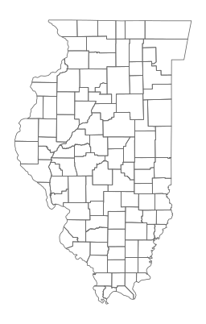{}
:::
:::


::: {.cell execution_count=8}
``` {.python .cell-code}
illinois_hdd = data["HeatingDegreeDays"].clip(illinois)
illinois_hdd.head(n=2)
```

::: {.cell-output .cell-output-display execution_count=8}

```{=html}
<div>
<style scoped>
    .dataframe tbody tr th:only-of-type {
        vertical-align: middle;
    }

    .dataframe tbody tr th {
        vertical-align: top;
    }

    .dataframe thead th {
        text-align: right;
    }
</style>
<table border="1" class="dataframe">
  <thead>
    <tr style="text-align: right;">
      <th></th>
      <th>OBJECTID</th>
      <th>Crossmodel</th>
      <th>Shape_Leng</th>
      <th>Shape_Area</th>
      <th>geometry</th>
      <th>hist</th>
      <th>rcp85_midc</th>
      <th>mid85_hist</th>
      <th>boundary</th>
      <th>centroid</th>
    </tr>
  </thead>
  <tbody>
    <tr>
      <th>21130</th>
      <td>21131</td>
      <td>R137C419</td>
      <td>61562.240069</td>
      <td>2.368692e+08</td>
      <td>POLYGON ((-9925519.402 4437348.204, -9922237.2...</td>
      <td>5618.240234</td>
      <td>5188.899902</td>
      <td>-429.347992</td>
      <td>LINESTRING (-9910499.397 4433932.370, -9913921...</td>
      <td>POINT (-9919714.441 4428138.497)</td>
    </tr>
    <tr>
      <th>15883</th>
      <td>15884</td>
      <td>R137C418</td>
      <td>61585.714048</td>
      <td>2.370499e+08</td>
      <td>MULTIPOLYGON (((-9940550.883 4440740.008, -993...</td>
      <td>5668.370117</td>
      <td>5196.740234</td>
      <td>-471.623993</td>
      <td>LINESTRING (-9943924.960 4425714.844, -9940550...</td>
      <td>POINT (-9934728.187 4431536.593)</td>
    </tr>
  </tbody>
</table>
</div>
```

:::
:::


::: {.cell execution_count=9}
``` {.python .cell-code}
_, ax = plt.subplots(figsize=(10, 7))
ax = illinois_hdd.boundary.plot(color='#666666', linewidth=0.8, ax=ax, alpha=0.2)
ax = illinois_hdd.plot(column='hist', ax=ax, legend=True)
ax.set_axis_off()
ax.set_title('Historical Heating Degree Days across Illinois')
plt.tight_layout()
```

::: {.cell-output .cell-output-display}
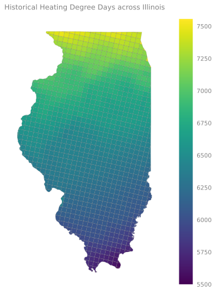{}
:::
:::


::: {.cell execution_count=10}
``` {.python .cell-code}
fig, ax = plt.subplots(ncols=3, figsize=(16, 7), sharey='row')
ax0 = illinois_hdd.plot('hist', ax=ax[0], legend=True)
ax1 = illinois_hdd.plot('rcp85_midc', ax=ax[1], legend=True)
ax2 = illinois_hdd.plot('mid85_hist', ax=ax[2], legend=True)
ax0.set_title("HDD: Historical")
ax1.set_title("HDD: Mid-Century RCP8.5")
ax2.set_title("HDD: (Mid-Century - Historical) RCP8.5")
ax0.set_axis_off()
ax1.set_axis_off()
ax2.set_axis_off()
plt.tight_layout()
```

::: {.cell-output .cell-output-display}
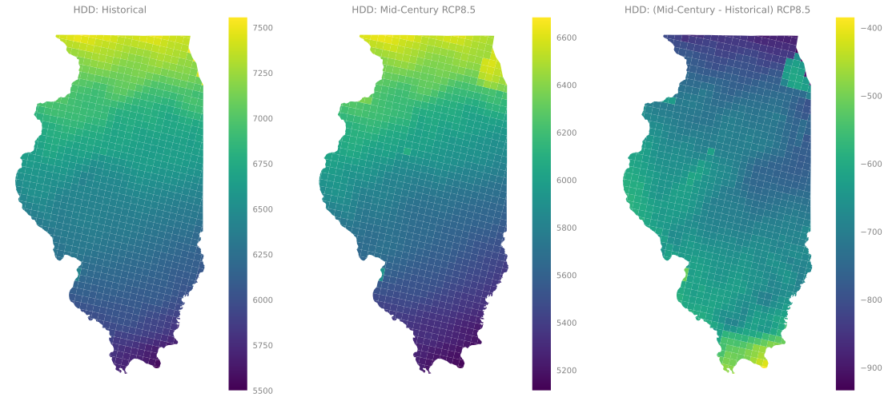{}
:::
:::


::: {.cell execution_count=11}
``` {.python .cell-code}
_, ax = plt.subplots(figsize=(10, 7))
ax = illinois_hdd.boundary.plot(color='#666666', linewidth=0.8, ax=ax, alpha=0.2)
ax = illinois_hdd.plot(column='rcp85_midc', ax=ax, legend=True)
ax.set_axis_off()
ax.set_title('RCP8.5 Mid-Century Heating Degree Days across Illinois')
plt.tight_layout()
```

::: {.cell-output .cell-output-display}
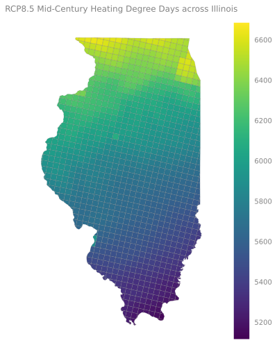{}
:::
:::


::: {.cell execution_count=12}
``` {.python .cell-code}
_, ax = plt.subplots(figsize=(10, 7))
ax = illinois_hdd.boundary.plot(color='#666666', linewidth=0.8, ax=ax, alpha=0.2)
ax = illinois_hdd.plot(column='mid85_hist', ax=ax, legend=True)
ax.set_axis_off()
ax.set_title('RCP8.5 End-Century Heating Degree Days across Illinois')
plt.tight_layout()
```

::: {.cell-output .cell-output-display}
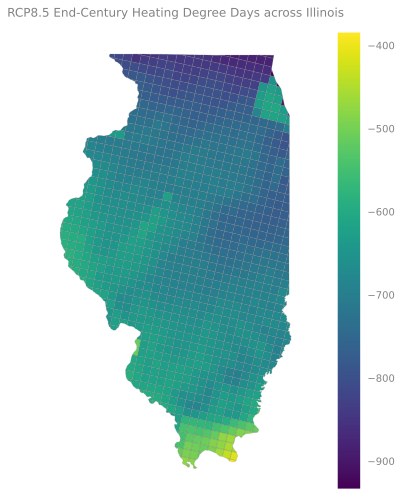{}
:::
:::


::: {.cell execution_count=13}
``` {.python .cell-code}
fig, ax = plt.subplots(figsize=(10, 7))
wind_il = data['WindSpeed'].clip(
    illinois,
    # how='intersection'
)
# ax = wind_il.boundary.plot(ax=ax, color='#666666', linewidth=0.8)
ax = wind_il.plot(column='hist', ax=ax, linewidth=0.8, legend=True)
ax.set_axis_off()
```

::: {.cell-output .cell-output-display}
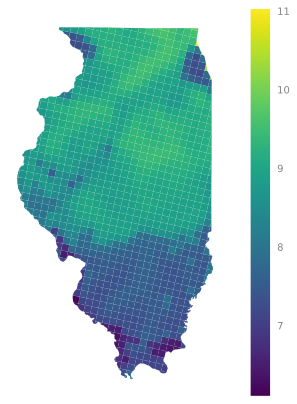{}
:::
:::


::: {.cell execution_count=14}
``` {.python .cell-code}
_, ax = plt.subplots(figsize=(10, 7))
ax = wind_il.boundary.plot(color='#666666', linewidth=0.8, ax=ax, alpha=0.2)
ax = wind_il.plot(column='hist', ax=ax, legend=True)
ax.set_axis_off()
ax.set_title('Historical Wind Data across Illinois')
plt.tight_layout()
```

::: {.cell-output .cell-output-display}
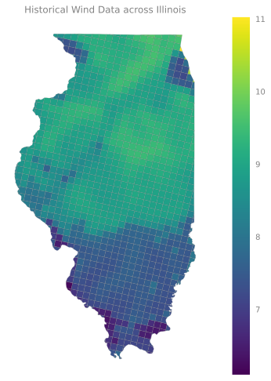{}
:::
:::


::: {.cell execution_count=15}
``` {.python .cell-code}
# wind_il.explore(column='hist')
wind_il.head(n=2)
```

::: {.cell-output .cell-output-display execution_count=15}

```{=html}
<div>
<style scoped>
    .dataframe tbody tr th:only-of-type {
        vertical-align: middle;
    }

    .dataframe tbody tr th {
        vertical-align: top;
    }

    .dataframe thead th {
        text-align: right;
    }
</style>
<table border="1" class="dataframe">
  <thead>
    <tr style="text-align: right;">
      <th></th>
      <th>OBJECTID</th>
      <th>Crossmodel</th>
      <th>Shape_Leng</th>
      <th>Shape_Area</th>
      <th>geometry</th>
      <th>hist</th>
      <th>rcp45_midc</th>
      <th>rcp45_endc</th>
      <th>rcp85_midc</th>
      <th>rcp85_endc</th>
      <th>mid45_hist</th>
      <th>end45_hist</th>
      <th>mid85_hist</th>
      <th>end85_hist</th>
      <th>mid85_45</th>
      <th>end85_45</th>
      <th>boundary</th>
      <th>centroid</th>
    </tr>
  </thead>
  <tbody>
    <tr>
      <th>21130</th>
      <td>21131</td>
      <td>R137C419</td>
      <td>61562.240069</td>
      <td>2.368692e+08</td>
      <td>POLYGON ((-9925519.402 4437348.204, -9922237.2...</td>
      <td>7.36933</td>
      <td>7.40137</td>
      <td>7.53169</td>
      <td>7.46885</td>
      <td>7.43563</td>
      <td>0.032043</td>
      <td>0.162359</td>
      <td>0.099523</td>
      <td>0.066305</td>
      <td>0.067481</td>
      <td>-0.096054</td>
      <td>LINESTRING (-9910499.397 4433932.370, -9913921...</td>
      <td>POINT (-9919714.441 4428138.497)</td>
    </tr>
    <tr>
      <th>15883</th>
      <td>15884</td>
      <td>R137C418</td>
      <td>61585.714048</td>
      <td>2.370499e+08</td>
      <td>MULTIPOLYGON (((-9940550.883 4440740.008, -993...</td>
      <td>7.76390</td>
      <td>7.78540</td>
      <td>7.90540</td>
      <td>7.86042</td>
      <td>7.82429</td>
      <td>0.021496</td>
      <td>0.141499</td>
      <td>0.096518</td>
      <td>0.060394</td>
      <td>0.075023</td>
      <td>-0.081105</td>
      <td>LINESTRING (-9943924.960 4425714.844, -9940550...</td>
      <td>POINT (-9934728.187 4431536.593)</td>
    </tr>
  </tbody>
</table>
</div>
```

:::
:::


::: {.cell execution_count=16}
``` {.python .cell-code}
_, ax = plt.subplots()
ax = wind_il.plot(column='hist', ax=ax, legend=True)
_ = ax.set_title('WindSpeed, historical')
ax.set_axis_off()
```

::: {.cell-output .cell-output-display}
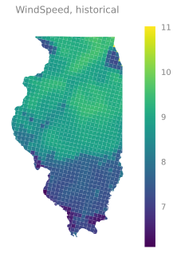{}
:::
:::


::: {.cell execution_count=17}
``` {.python .cell-code}
fig, ax = plt.subplots()
ax = wind_il.plot(column='rcp45_midc', ax=ax, legend=True)
ax.set_axis_off()
_ = ax.set_title('WindSpeed, Mid-Century [RCP45]')
```

::: {.cell-output .cell-output-display}
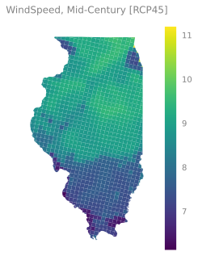{}
:::
:::


::: {.cell execution_count=18}
``` {.python .cell-code}
fig, ax = plt.subplots()
_ = ax.set_title('WindSpeed, End-Century [RCP45]')
# _ = ax.legend(loc='best')
ax = wind_il.plot(column='rcp45_endc', ax=ax, legend=True)
ax.set_axis_off()
```

::: {.cell-output .cell-output-display}
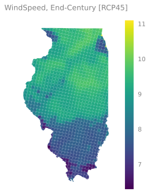{}
:::
:::


::: {.cell execution_count=19}
``` {.python .cell-code}
fig, ax = plt.subplots(ncols=3, figsize=(16, 7))
ax0 = wind_il.plot('hist', ax=ax[0], legend=True)
ax1 = wind_il.plot('rcp45_midc', ax=ax[1], legend=True)
ax2 = wind_il.plot('rcp45_endc', ax=ax[2], legend=True)
ax0.set_title("Wind Speed: Historical")
ax1.set_title("Wind Speed: Mid-Century RCP4.5")
ax2.set_title("Wind Speed: End-Century RCP4.5")
ax0.set_axis_off()
ax1.set_axis_off()
ax2.set_axis_off()
plt.tight_layout()
```

::: {.cell-output .cell-output-display}
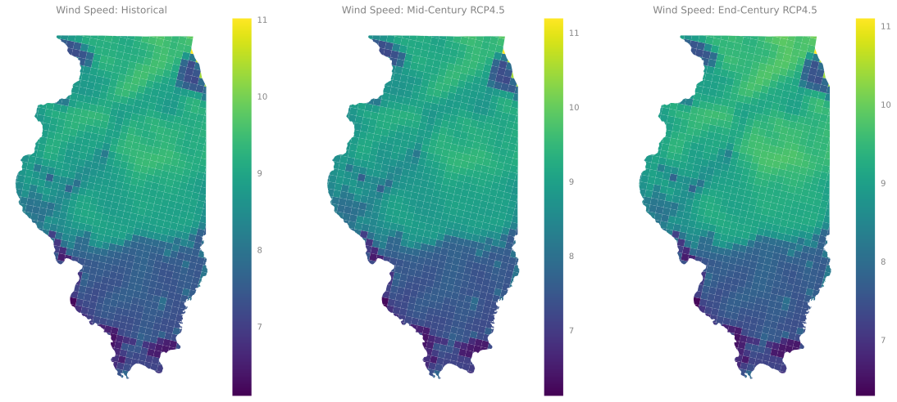{}
:::
:::


::: {.cell execution_count=20}
``` {.python .cell-code}
fig, ax = plt.subplots(ncols=3, figsize=(16, 7))
ax0 = wind_il.plot('hist', ax=ax[0], legend=True)
ax1 = wind_il.plot('rcp85_midc', ax=ax[1], legend=True)
ax2 = wind_il.plot('rcp85_endc', ax=ax[2], legend=True)
ax0.set_title("Wind Speed: Historical")
ax1.set_title("Wind Speed: Mid-Century RCP8.5")
ax2.set_title("Wind Speed: End-Century RCP8.5")
ax0.set_axis_off()
ax1.set_axis_off()
ax2.set_axis_off()
plt.tight_layout()
```

::: {.cell-output .cell-output-display}
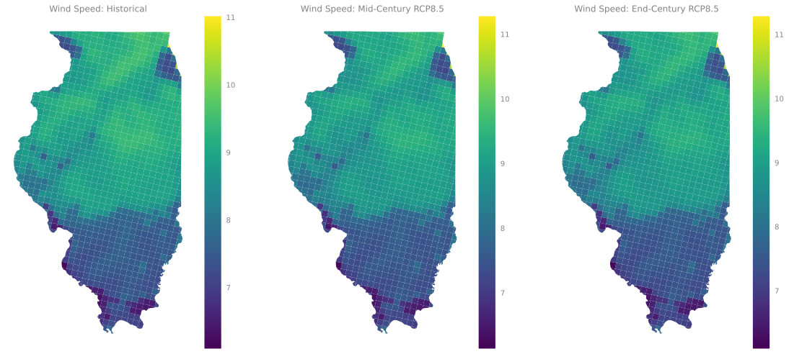{}
:::
:::


::: {.cell execution_count=21}
``` {.python .cell-code}
data['WindSpeed'].shape
```

::: {.cell-output .cell-output-display execution_count=21}
```
(62834, 18)
```
:::
:::


::: {.cell execution_count=22}
``` {.python .cell-code}
selection = shape[0:5]

for index, row in selection.iterrows():
    # get the area of the polygon
    poly_area = row['geometry'].area
    console.print(f"Polygon area at {index} is {poly_area:.3f}")
```

::: {.cell-output .cell-output-display}

```{=html}
<pre style="white-space:pre;overflow-x:auto;line-height:normal;font-family:Menlo,'DejaVu Sans Mono',consolas,'Courier New',monospace">Polygon area at <span style="color: #2094f3; text-decoration-color: #2094f3">0</span> is <span style="color: #2094f3; text-decoration-color: #2094f3">252927293.657</span>
</pre>
```

:::

::: {.cell-output .cell-output-display}

```{=html}
<pre style="white-space:pre;overflow-x:auto;line-height:normal;font-family:Menlo,'DejaVu Sans Mono',consolas,'Courier New',monospace">Polygon area at <span style="color: #2094f3; text-decoration-color: #2094f3">1</span> is <span style="color: #2094f3; text-decoration-color: #2094f3">235501313.715</span>
</pre>
```

:::

::: {.cell-output .cell-output-display}

```{=html}
<pre style="white-space:pre;overflow-x:auto;line-height:normal;font-family:Menlo,'DejaVu Sans Mono',consolas,'Courier New',monospace">Polygon area at <span style="color: #2094f3; text-decoration-color: #2094f3">2</span> is <span style="color: #2094f3; text-decoration-color: #2094f3">233416379.950</span>
</pre>
```

:::

::: {.cell-output .cell-output-display}

```{=html}
<pre style="white-space:pre;overflow-x:auto;line-height:normal;font-family:Menlo,'DejaVu Sans Mono',consolas,'Courier New',monospace">Polygon area at <span style="color: #2094f3; text-decoration-color: #2094f3">3</span> is <span style="color: #2094f3; text-decoration-color: #2094f3">261761834.191</span>
</pre>
```

:::

::: {.cell-output .cell-output-display}

```{=html}
<pre style="white-space:pre;overflow-x:auto;line-height:normal;font-family:Menlo,'DejaVu Sans Mono',consolas,'Courier New',monospace">Polygon area at <span style="color: #2094f3; text-decoration-color: #2094f3">4</span> is <span style="color: #2094f3; text-decoration-color: #2094f3">226073092.218</span>
</pre>
```

:::
:::


