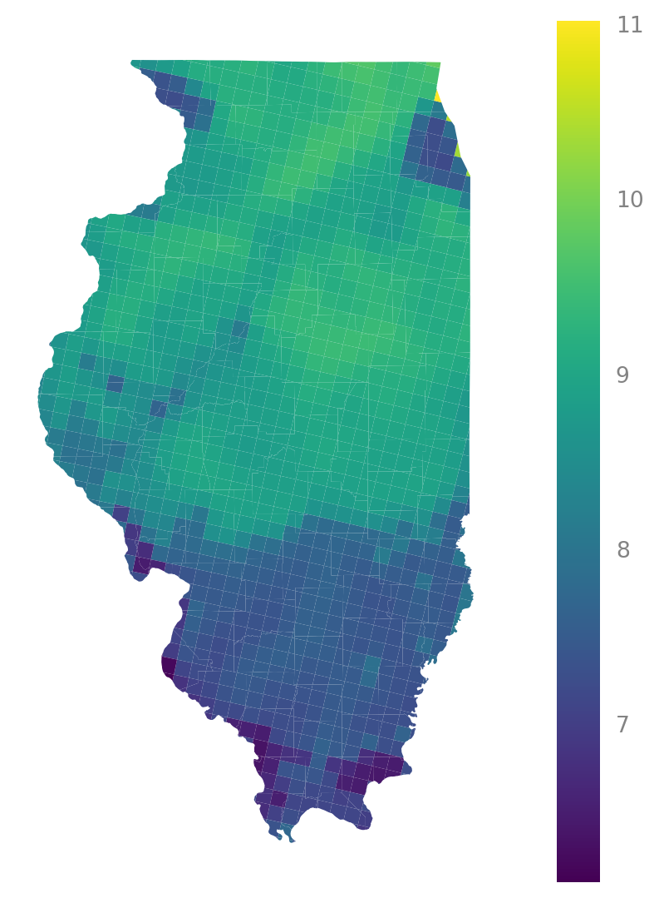
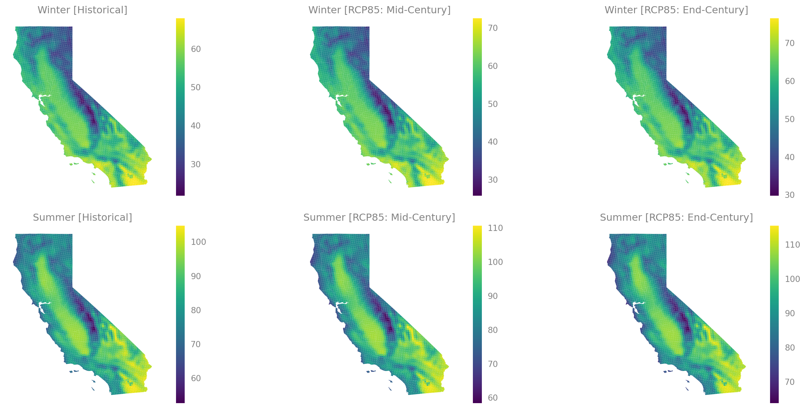

::: {.cell execution_count=1}
``` {.python .cell-code}
import matplotlib.pyplot as plt
import geopandas as gpd

from typing import Optional
from enrich.style import STYLES
from rich.theme import Theme
from rich.console import Console

from ClimRR import (
    set_plot_style,
    get_logger,
    DEFAULT_CRS,
)
from ClimRR.data import (
    load_shapefile,
    load_csvs,
    load_counties,
    load_chicago_data
)

set_plot_style()
theme = Theme(STYLES)
log = get_logger('ClimRR')
console = Console(theme=theme, log_path=False, markup=True)
```

::: {.cell-output .cell-output-stderr}
```
/Users/samforeman/miniconda3/envs/ClimRR/lib/python3.11/site-packages/pyproj/__init__.py:91: UserWarning: Valid PROJ data directory not found. Either set the path using the environmental variable PROJ_DATA (PROJ 9.1+) | PROJ_LIB (PROJ<9.1) or with `pyproj.datadir.set_data_dir`.
  warnings.warn(str(err))
```
:::
:::


::: {.cell execution_count=2}
``` {.python .cell-code}
shape = load_shapefile()
data = load_csvs(shape)
chidata = load_chicago_data(shape.crs)
```

::: {.cell-output .cell-output-display}

```{=html}
<pre style="white-space:pre;overflow-x:auto;line-height:normal;font-family:Menlo,'DejaVu Sans Mono',consolas,'Courier New',monospace">data<span style="font-weight: bold">[</span><span style="color: #008000; text-decoration-color: #008000">'FireWeatherIndex_Wildfire'</span><span style="font-weight: bold">]</span>.<span style="color: #7d8697; text-decoration-color: #7d8697">shape</span>=<span style="font-weight: bold">(</span><span style="color: #2094f3; text-decoration-color: #2094f3">62834</span>, <span style="color: #2094f3; text-decoration-color: #2094f3">35</span><span style="font-weight: bold">)</span>
</pre>
```

:::

::: {.cell-output .cell-output-display}

```{=html}
<pre style="white-space:pre;overflow-x:auto;line-height:normal;font-family:Menlo,'DejaVu Sans Mono',consolas,'Courier New',monospace">data<span style="font-weight: bold">[</span><span style="color: #008000; text-decoration-color: #008000">'HeatingDegreeDays'</span><span style="font-weight: bold">]</span>.<span style="color: #7d8697; text-decoration-color: #7d8697">shape</span>=<span style="font-weight: bold">(</span><span style="color: #2094f3; text-decoration-color: #2094f3">62834</span>, <span style="color: #2094f3; text-decoration-color: #2094f3">10</span><span style="font-weight: bold">)</span>
</pre>
```

:::

::: {.cell-output .cell-output-display}

```{=html}
<pre style="white-space:pre;overflow-x:auto;line-height:normal;font-family:Menlo,'DejaVu Sans Mono',consolas,'Courier New',monospace">data<span style="font-weight: bold">[</span><span style="color: #008000; text-decoration-color: #008000">'AnnualTemperatureMinimum'</span><span style="font-weight: bold">]</span>.<span style="color: #7d8697; text-decoration-color: #7d8697">shape</span>=<span style="font-weight: bold">(</span><span style="color: #2094f3; text-decoration-color: #2094f3">62834</span>, <span style="color: #2094f3; text-decoration-color: #2094f3">18</span><span style="font-weight: bold">)</span>
</pre>
```

:::

::: {.cell-output .cell-output-display}

```{=html}
<pre style="white-space:pre;overflow-x:auto;line-height:normal;font-family:Menlo,'DejaVu Sans Mono',consolas,'Courier New',monospace">data<span style="font-weight: bold">[</span><span style="color: #008000; text-decoration-color: #008000">'SeasonalTemperatureMaximum'</span><span style="font-weight: bold">]</span>.<span style="color: #7d8697; text-decoration-color: #7d8697">shape</span>=<span style="font-weight: bold">(</span><span style="color: #2094f3; text-decoration-color: #2094f3">62834</span>, <span style="color: #2094f3; text-decoration-color: #2094f3">27</span><span style="font-weight: bold">)</span>
</pre>
```

:::

::: {.cell-output .cell-output-display}

```{=html}
<pre style="white-space:pre;overflow-x:auto;line-height:normal;font-family:Menlo,'DejaVu Sans Mono',consolas,'Courier New',monospace">data<span style="font-weight: bold">[</span><span style="color: #008000; text-decoration-color: #008000">'ConsecutiveDayswithNoPrecipitation'</span><span style="font-weight: bold">]</span>.<span style="color: #7d8697; text-decoration-color: #7d8697">shape</span>=<span style="font-weight: bold">(</span><span style="color: #2094f3; text-decoration-color: #2094f3">55896</span>, <span style="color: #2094f3; text-decoration-color: #2094f3">19</span><span style="font-weight: bold">)</span>
</pre>
```

:::

::: {.cell-output .cell-output-display}

```{=html}
<pre style="white-space:pre;overflow-x:auto;line-height:normal;font-family:Menlo,'DejaVu Sans Mono',consolas,'Courier New',monospace">data<span style="font-weight: bold">[</span><span style="color: #008000; text-decoration-color: #008000">'SeasonalTemperatureMinimum'</span><span style="font-weight: bold">]</span>.<span style="color: #7d8697; text-decoration-color: #7d8697">shape</span>=<span style="font-weight: bold">(</span><span style="color: #2094f3; text-decoration-color: #2094f3">62834</span>, <span style="color: #2094f3; text-decoration-color: #2094f3">27</span><span style="font-weight: bold">)</span>
</pre>
```

:::

::: {.cell-output .cell-output-display}

```{=html}
<pre style="white-space:pre;overflow-x:auto;line-height:normal;font-family:Menlo,'DejaVu Sans Mono',consolas,'Courier New',monospace">data<span style="font-weight: bold">[</span><span style="color: #008000; text-decoration-color: #008000">'WindSpeed'</span><span style="font-weight: bold">]</span>.<span style="color: #7d8697; text-decoration-color: #7d8697">shape</span>=<span style="font-weight: bold">(</span><span style="color: #2094f3; text-decoration-color: #2094f3">62834</span>, <span style="color: #2094f3; text-decoration-color: #2094f3">18</span><span style="font-weight: bold">)</span>
</pre>
```

:::

::: {.cell-output .cell-output-display}

```{=html}
<pre style="white-space:pre;overflow-x:auto;line-height:normal;font-family:Menlo,'DejaVu Sans Mono',consolas,'Courier New',monospace">data<span style="font-weight: bold">[</span><span style="color: #008000; text-decoration-color: #008000">'AnnualTemperatureMaximum'</span><span style="font-weight: bold">]</span>.<span style="color: #7d8697; text-decoration-color: #7d8697">shape</span>=<span style="font-weight: bold">(</span><span style="color: #2094f3; text-decoration-color: #2094f3">62834</span>, <span style="color: #2094f3; text-decoration-color: #2094f3">18</span><span style="font-weight: bold">)</span>
</pre>
```

:::

::: {.cell-output .cell-output-display}

```{=html}
<pre style="white-space:pre;overflow-x:auto;line-height:normal;font-family:Menlo,'DejaVu Sans Mono',consolas,'Courier New',monospace">data<span style="font-weight: bold">[</span><span style="color: #008000; text-decoration-color: #008000">'Precipitation_inches_AnnualTotal'</span><span style="font-weight: bold">]</span>.<span style="color: #7d8697; text-decoration-color: #7d8697">shape</span>=<span style="font-weight: bold">(</span><span style="color: #2094f3; text-decoration-color: #2094f3">55896</span>, <span style="color: #2094f3; text-decoration-color: #2094f3">18</span><span style="font-weight: bold">)</span>
</pre>
```

:::
:::


::: {.cell execution_count=3}
``` {.python .cell-code}
counties = load_counties(shape.crs)
```
:::


::: {.cell execution_count=4}
``` {.python .cell-code}
illinois = counties[counties["ste_name"] == "['Illinois']"]
wind_il = data["WindSpeed"].overlay(illinois, how='intersection')
```
:::


::: {.cell execution_count=5}
``` {.python .cell-code}
fig, ax = plt.subplots(figsize=(10, 7))
wind_il.plot(ax=ax, column='hist', legend=True)
ax.set_axis_off()
plt.show()
```

::: {.cell-output .cell-output-display}
{width=397 height=540}
:::
:::


::: {.cell execution_count=6}
``` {.python .cell-code}
console.log("\n".join(list(data.keys())))
```

::: {.cell-output .cell-output-display}

```{=html}
<pre style="white-space:pre;overflow-x:auto;line-height:normal;font-family:Menlo,'DejaVu Sans Mono',consolas,'Courier New',monospace"><span style="color: #696969; text-decoration-color: #696969">[07:00:13] </span>FireWeatherIndex_Wildfire                                                         
<span style="color: #696969; text-decoration-color: #696969">           </span>HeatingDegreeDays                                                                 
<span style="color: #696969; text-decoration-color: #696969">           </span>AnnualTemperatureMinimum                                                          
<span style="color: #696969; text-decoration-color: #696969">           </span>SeasonalTemperatureMaximum                                                        
<span style="color: #696969; text-decoration-color: #696969">           </span>ConsecutiveDayswithNoPrecipitation                                                
<span style="color: #696969; text-decoration-color: #696969">           </span>SeasonalTemperatureMinimum                                                        
<span style="color: #696969; text-decoration-color: #696969">           </span>WindSpeed                                                                         
<span style="color: #696969; text-decoration-color: #696969">           </span>AnnualTemperatureMaximum                                                          
<span style="color: #696969; text-decoration-color: #696969">           </span>Precipitation_inches_AnnualTotal                                                  
</pre>
```

:::
:::


::: {.cell execution_count=7}
``` {.python .cell-code}
def get_state(
        state: str,
        counties: Optional[gpd.GeoDataFrame] = None,
) -> gpd.GeoDataFrame:
    counties = load_counties(DEFAULT_CRS) if counties is None else counties
    assert counties is not None and isinstance(counties, gpd.GeoDataFrame)
    assert counties.crs == DEFAULT_CRS
    return counties[counties["ste_name"] == f"['{state}']"]


def get_variable_for_state(
        data: gpd.GeoDataFrame,
        state: gpd.GeoDataFrame,
) -> gpd.GeoDataFrame:
    """Returns `data.overlay(state, how='intersection')`"""
    return data.overlay(state, how='intersection')
```
:::


::: {.cell execution_count=8}
``` {.python .cell-code}
california = get_state('California', counties=counties)
```
:::


::: {.cell execution_count=9}
``` {.python .cell-code}
fig, ax = plt.subplots(figsize=(10, 7))
ax = california.plot(ax=ax)
ax.set_axis_off()
```

::: {.cell-output .cell-output-display}
{width=468 height=537}
:::
:::


::: {.cell execution_count=10}
``` {.python .cell-code}
cali_temp_max = get_variable_for_state(
    data["SeasonalTemperatureMaximum"],
    california
)
```
:::


::: {.cell execution_count=11}
``` {.python .cell-code}
fig, ax = plt.subplots(figsize=(16, 7), nrows=2, ncols=3, sharey='row', sharex='col')
ax = ax.flatten()
ax0 = cali_temp_max.plot(ax=ax[0], column='hist_winter', legend=True)
ax0.set_title('Winter [Historical]')
ax0.set_axis_off()
ax1 = cali_temp_max.plot(ax=ax[1], column='rcp85_midc_winter', legend=True)
ax1.set_axis_off()
ax1.set_title('Winter [RCP85: Mid-Century]')
ax2 = cali_temp_max.plot(ax=ax[2], column='rcp85_endc_winter', legend=True)
ax2.set_axis_off()
ax2.set_title('Winter [RCP85: End-Century]')

ax3 = cali_temp_max.plot(ax=ax[3], column='hist_summer', legend=True)
ax3.set_title('Summer [Historical]')
ax3.set_axis_off()
ax4 = cali_temp_max.plot(ax=ax[4], column='rcp85_mid_summer', legend=True)
ax4.set_axis_off()
ax4.set_title('Summer [RCP85: Mid-Century]')
ax5 = cali_temp_max.plot(ax=ax[5], column='rcp85_end_summer', legend=True)
ax5.set_axis_off()
ax5.set_title('Summer [RCP85: End-Century]')
plt.tight_layout()
```

::: {.cell-output .cell-output-display}
{width=1301 height=662}
:::
:::


